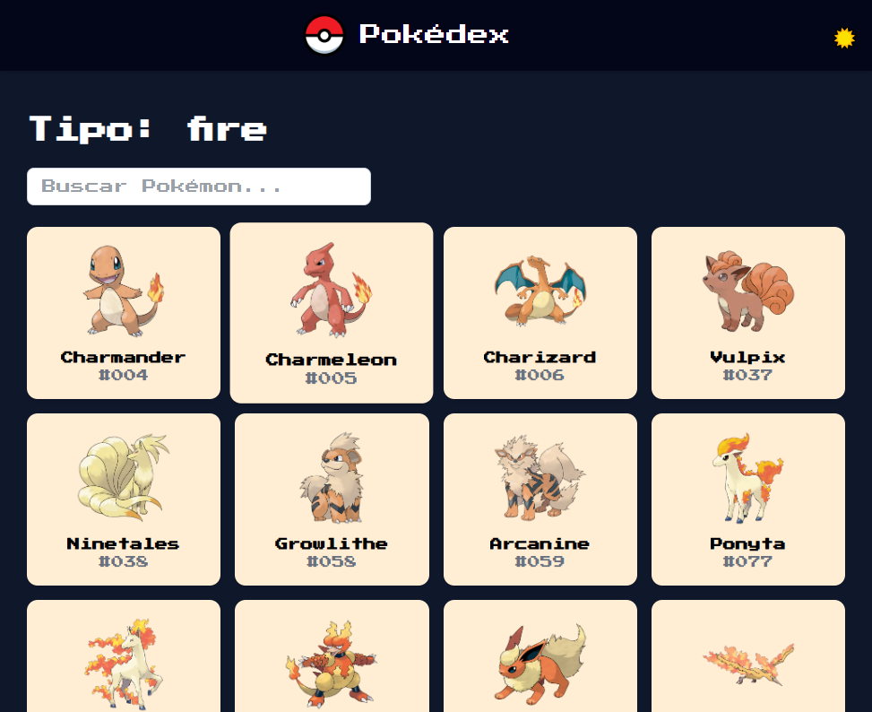
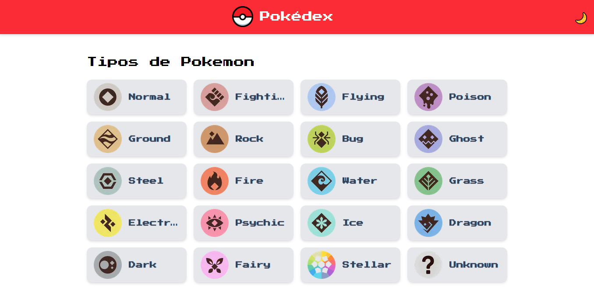
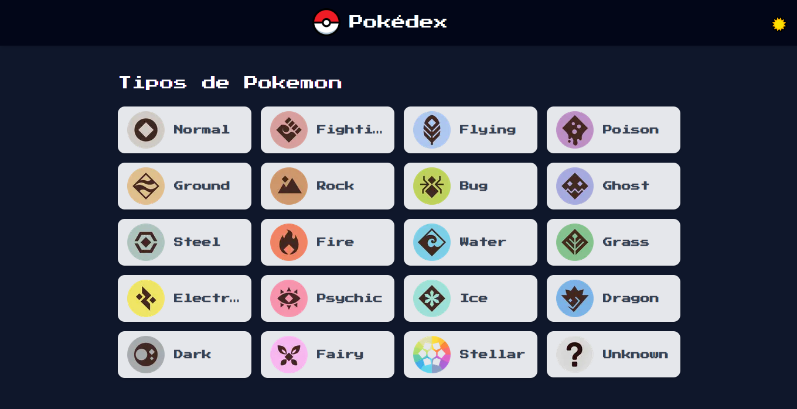
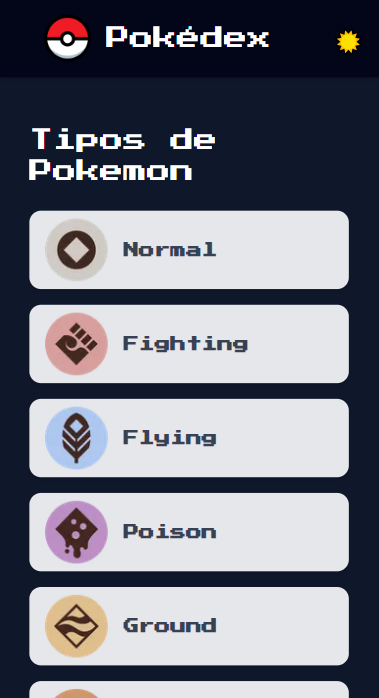
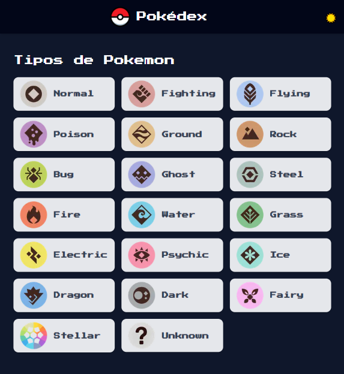

## Pokédex Web

Una aplicación web moderna estilo retro que permite explorar Pokémon por tipo, buscar por nombre, ver detalles individuales y alternar entre modo claro y oscuro 🌞🌙.

Desarrollada con Next.js 15, TailwindCSS, y la PokéAPI.

## 🎮 Funcionalidades

- Filtrado de Pokémon por nombre

- Modo claro/oscuro con íconos y persistencia de tema

- Diseño responsive

- Paginación en cliente

- Carga con Skeleton mientras se obtienen los datos

- Detalles en modal con nombre, imagen y habilidades

- Colores personalizados por tipo de Pokémon

- Loader animado al navegar entre tipos

## 🛠️ Tecnologías

- Next.js 15 (App Router)

- TailwindCSS

- PokéAPI

- TypeScript

- Vercel para despliegue

## 📸 Capturas

- Vista por tipos
  

💡 Modo claro y oscuro

- Claro

  

- Oscuro

  

📱 Vista movil / IPad

- Movil

  

- IPad

  

## 🚀 Deploy

La app está publicada en Vercel y podés probarla aquí:

🔗 https://pokedex-nine-silk.vercel.app

## 🧑‍💻 Instalación local

- git clone https://github.com/jfthdz/pokedex-web.git

- cd pokedex-web

- npm install

- npm run dev

## 📁 Estructura del proyecto

.

├── public/assets # Íconos, imagenes de tipos de Pokémon

├── src/app # Rutas y páginas principales

├── src/components # Componentes UI como Card, Modal, Header

├── src/lib # Funciones para llamadas a la API (fetch)

├── src/types # Interfaces TypeScript

## Autor

Desarrollado por Jafet Hernández A. | Full Stack Developer.
